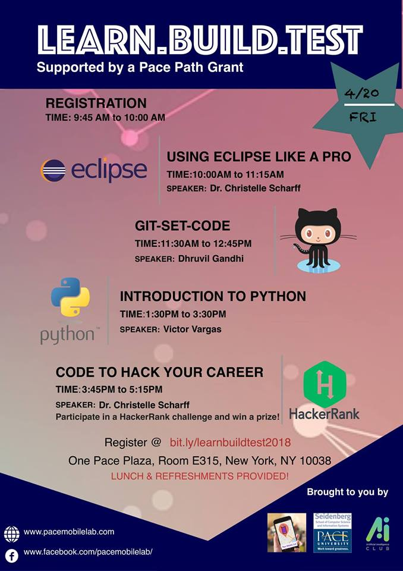

# Python from 0 to hero Workshop

## Prerequisites:
1. Previous programming experience (either in Python or in another language)
2. Set up the environment:
    - Install the latest version of [Anaconda](https://www.anaconda.com/download/) for **Python 3.6**
    - Lunch a Jupyter notebook
    
## About me

I am a GA/ web developer at lubin and president and founder of the AI Club.

I'm in the last semester of an MS in CS focused on AI and ML, currently working on several deep learning academic projects.

Previously, I worked as a Software Engineer for about 3 years, wearing multiple hats, front-end, back-end, self-employed, android developer, manager, and BI analyst. I have worked with consultancies, marketing organizations, and freelance projects.

I’m from Venezuela thus I also speak Spanish.

My website: **[vmvargas.com](https://vmvargas.com)**

Sign up for the AI Club at **https://bit.ly/aiclub-signup/** (besides workshop like this we hold talks, forums, writings, screening, and more).

## About Python

Python is an incredibly efficient language: your programs will do more in fewer lines of code than many other languages would require. 

Python’s syntax will also help you write *clean* code. Your code will be easy to read, easy to debug, and easy to extend and build upon compared to other languages.

People use Python for many purposes:

- to make games,
- build web applications,
- solve business problems,
- develop internal tools for all kinds of interesting companies. 

Python is also used heavily in scientific fields for academic research and applied work.

[Python Developers Survey 2017 Results](
https://www.jetbrains.com/research/python-developers-survey-2017/)

## About the workshop

### Why this workshop?

The goal of this workshop is to bring you up to speed with Python as quickly as possible so you can build programs that work (games, data visualizations, and web applications) while developing a foundation in programming that will serve you well for the rest of your life.

### What’s out of the scope?

- Python 2
- Testing a function
- Testing a class
- Regular Expressions
- Django
- Keras / Theano / TensorFlow / scikit-learn and similar
- NumPy / pandas / scipy and similar

### What will you learn?

#### PART I: Python Foundations

    1. Variables and Simple Data Types
    2. Lists
    3. if Statements
    4. Dictionaries
    5. User Input and while Loops
    6. Functions
    7. Classes
    8. Files and Exceptions

#### PART II: A Data Visualization Project

    1. Plot data
    2. Read data from a CSV File

### Resources

Most of the content was extracted from *Matthes, Eric. Python Crash Course: a Hands-on, Project-Based Introduction to Programming. No Starch Press, 2016, [nostarch.com/pythoncrashcourse](nostarch.com/pythoncrashcourse).* 

You can read this book for free at [https://ebookcentral-proquest-com.rlib.pace.edu/lib/pace/bookshelf.action](https://ebookcentral-proquest-com.rlib.pace.edu/lib/pace/bookshelf.action)

You can also download book's resources from https://ehmatthes.github.io/pcc/

# Event's Flyer

